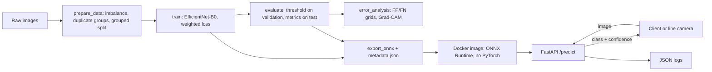
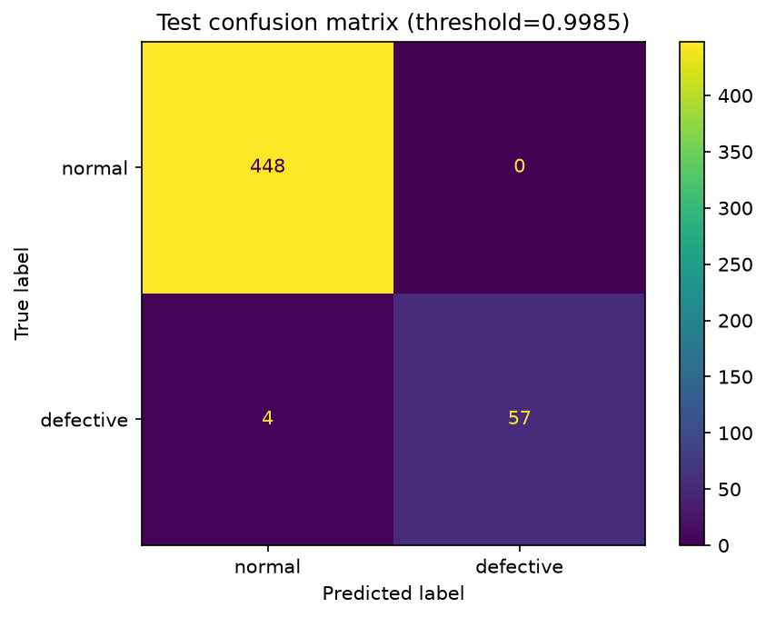
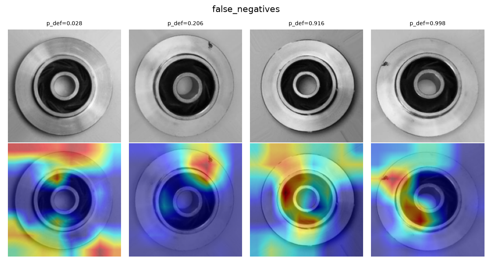

# Casting Product Defect Detection

An end-to-end visual inspection system: a transfer-learning classifier that labels casting-product images as **normal** or **defective**, exported to ONNX and served through a validated, logged FastAPI service that runs in Docker.

> **Data note.** The client's own dataset was not provided, so everything here uses the public Kaggle dataset *Casting Product Image Data for Quality Inspection* (`ravirajsinh45/real-life-industrial-dataset-of-casting-product`; check its license on the Kaggle page). All metrics are on that dataset, not on client data.

## Contents
1. [Architecture](#architecture)
2. [Project structure](#project-structure)
3. [Setup](#setup)
4. [Reproduce training and evaluation](#reproduce-training-and-evaluation)
5. [Dataset strategy](#dataset-strategy)
6. [Model approach and reasoning](#model-approach-and-reasoning)
7. [Decision threshold](#decision-threshold)
8. [Evaluation results](#evaluation-results)
9. [Error analysis](#error-analysis)
10. [Inference API](#inference-api)
11. [Docker and deployment](#docker-and-deployment)
12. [Latency and trade-offs](#latency-and-trade-offs)
13. [Known limitations](#known-limitations)
14. [Production next steps (not implemented)](#production-next-steps-not-implemented)

## Architecture



Training code (`src/`) and serving code (`app/`) are separate on purpose: the Docker image contains only inference dependencies (ONNX Runtime, OpenCV, FastAPI), not PyTorch.

## Project structure

```
├── src/
│   ├── prepare_data.py    # collect images, simulate imbalance, group near-duplicates, split
│   ├── common.py          # transforms, dataset, model builder (shared)
│   ├── train.py           # two-stage transfer learning, weighted loss
│   ├── threshold.py       # validation-only threshold selection
│   ├── evaluate.py        # metrics, confidence intervals, error list
│   ├── error_analysis.py  # false positive / false negative grids + Grad-CAM
│   ├── export_onnx.py     # ONNX export, parity check, metadata.json
│   └── benchmark.py       # CPU latency
├── app/main.py            # FastAPI service
├── tests/                 # API and threshold tests
├── models/                # model.onnx, metadata.json, threshold.json
├── reports/               # confusion matrix, error grids, metrics, example predictions
├── Dockerfile, docker-compose.yml
├── requirements.txt       # serving only
└── requirements-train.txt # training and evaluation
```

## Setup

Python 3.10 to 3.12 is recommended. Install PyTorch first so you choose the right build (CPU or CUDA).

```bash
python -m venv .venv
source .venv/bin/activate            # Windows PowerShell: .venv\Scripts\Activate.ps1
pip install torch torchvision        # or use the CPU/CUDA index URL from pytorch.org
pip install -r requirements-train.txt

# dataset (needs a Kaggle API token), or download the zip manually from the Kaggle page
kaggle datasets download -d ravirajsinh45/real-life-industrial-dataset-of-casting-product
unzip real-life-industrial-dataset-of-casting-product.zip -d data/raw
```

The scripts search `data/raw` recursively. Only the parent folder name matters: `ok_front` is normal, `def_front` is defective.

## Reproduce training and evaluation

Run from the project root, in this order (each step produces files the next one reads):

```bash
python src/prepare_data.py     # -> data/splits.csv
python src/train.py            # -> models/best.pt
python src/evaluate.py         # -> models/threshold.json, reports/metrics.json, confusion matrix
python src/error_analysis.py   # -> reports/false_negatives.png, reports/false_positives.png
python src/export_onnx.py      # -> models/model.onnx, models/metadata.json
python src/benchmark.py        # CPU latency
python -m pytest -q
```

Seeds are fixed (42) and the split is deterministic. Results can still differ slightly across hardware and library versions. `data/splits.csv` is not committed because it stores local file paths; regenerate it with `prepare_data.py`.

## Dataset strategy

- **Original data:** `<<FILL: original counts per class and per original split, from the prepare_data.py output>>`.
- **Simulated imbalance.** The public dataset is close to balanced, but real production lines produce far fewer defects than good parts. To exercise the imbalance requirement, I kept every normal image and subsampled defective images to about **12%** of the data (`--defect_ratio 0.12`). This is a simulation. The true defect rate on a real line may be different.
- **Fresh split instead of the provided one.** I could not verify that the dataset's own train/test split is free of near-duplicates, so I merged everything and re-split it.
- **Leakage control.** Perceptual hashes (pHash) group images that are near-identical (Hamming distance at most `<<FILL: hash_thr used>>`), and a `StratifiedGroupKFold` split keeps each group in exactly one split while preserving the class ratio. `<<FILL: number of groups and largest group size, from the prepare_data.py output>>`.
- **Final split (about 72/14/14):** `<<FILL: train / val / test counts per class>>`. The test set has 61 defective and 448 normal images.
- **Test set discipline.** The test set is used only for final evaluation. The threshold is chosen on validation data. One exception is disclosed in [Decision threshold](#decision-threshold).

**Why these choices:** random splitting of near-duplicate images inflates test scores. A realistic class ratio makes precision and recall meaningful, because accuracy alone would reward a model that always says "normal".

## Model approach and reasoning

| Decision | Choice | Why | Alternatives considered |
|---|---|---|---|
| Backbone | EfficientNet-B0 (timm, ImageNet-pretrained) | About 5M parameters, strong accuracy per FLOP, fast on CPU, exports cleanly to ONNX | ResNet-18/50 (robust baseline, larger), MobileNetV3 (faster, slightly less accurate), ConvNeXt-Tiny / ViT (heavier, need more data), CNN from scratch (overfits small data) |
| Transfer learning | Train the head, then fine-tune everything | Pretrained edges and textures transfer to metal surfaces; a random head would otherwise damage pretrained weights with large gradients | Frozen backbone only (cheaper, less accurate), full fine-tune from step one (less stable) |
| Imbalance | Class-weighted cross-entropy (weight = normal count / defective count) | Simple, no duplicated images, works well with fine-tuning | `WeightedRandomSampler` (repeats few defect images), focal loss, anomaly detection trained on normal images only (PatchCore/PaDiM) |
| Input size | 256 x 256 (native images are 300 x 300) | Small downscale, keeps small cracks and pits visible | 224 (faster, riskier for tiny defects), 300 (about 1.4x the compute) |
| Augmentation | Flips, rotation up to 15 degrees, mild brightness/contrast, light noise | A cast part has no fixed orientation; lighting varies on a line | Random crops were avoided because they can remove the defect while keeping the label |
| Optimiser | AdamW, lr 1e-3 for the head (4 epochs), 1e-4 with cosine decay for fine-tuning (6 epochs), batch size 32 | Standard, robust defaults | SGD with momentum (needs more tuning) |
| Checkpoint | Best validation PR-AUC; ties broken by lowest validation log-loss | PR-AUC is honest under imbalance. In my runs validation PR-AUC reached about 1.0 within the first one or two fine-tuning epochs, so a tie-break is needed to keep selection meaningful | Accuracy (misleading under imbalance), F1 (depends on a threshold) |

Validation and test images get no random augmentation, only resize and normalisation, so metrics are deterministic.

## Decision threshold

Defects are rarer and costlier to miss than a good part is to re-inspect, so the threshold is chosen to protect recall on the defective class.

- **Final rule (`src/threshold.py`):** on validation data only, take the middle of the gap between the highest-scoring normal image and the 5th percentile of defect scores, computed in logit space. This leaves a safety margin on both sides. If the classes overlap on validation, it falls back to the threshold that maximises F2 (recall weighted twice as much as precision). The chosen threshold is `<<FILL: threshold from models/threshold.json>>` (`<<FILL: method printed by evaluate.py>>`).
- **What went wrong first, and why I changed it.** My first rule was "the highest threshold that still reaches 95% validation recall". Validation scores were perfectly separated and saturated near 0 and 1, so that rule landed on the extreme edge of the validation defect scores, at a probability of about 0.99995. On the test set, 11 of 61 defects scored just below it: defect recall was **0.82** with 0 false positives, even though ROC-AUC was about 0.9998. The model ranked images well; the threshold rule was brittle.
- **Disclosure.** I changed the rule after seeing that test result, so the test set was effectively seen twice. The final test numbers below may be slightly optimistic. The new rule uses validation data only.

## Evaluation results

Test set (61 defective, 448 normal), threshold ` [[448   0]
 [  2  59]]:

| Class | Precision | Recall | F1 | Support |
|---|---|---|---|---|
| normal | 0.9912  |    1.0000  | 0.9956 | 448 |
| defective |1.0000 |    0.9344    |  0.9661 | 61 |

- PR-AUC 0.9987 , ROC-AUC 0.9998.
- Confusion matrix (`[[TN, FP], [FN, TP]]`): ` [[448   0]
 [  4  57]]`.
- Bootstrap 95% confidence interval for defect recall: `95% `; for defect precision: `95% `. With only 61 defective test images, one missed defect moves recall by about 1.6 points, so treat the numbers as estimates with wide intervals.



Full numbers are in `reports/metrics.json`.

**Reading the metrics here:** recall on the defective class is the share of real defects caught (a miss ships a bad part). Precision is the share of flagged parts that are truly defective (a false alarm costs a re-inspection). PR-AUC is threshold-free and less flattering than ROC-AUC under imbalance.

## Error analysis

Errors were saved to `reports/errors_test.csv` and visualised with Grad-CAM (`reports/false_negatives.png`, `reports/false_positives.png`). The top row of each grid is the image with its defect probability, the bottom row shows where the model looked.




*(If a grid image does not exist because there were no errors of that kind, delete its line and say so in the text.)*

- **False negatives (missed defects):** `<<FILL: how many; describe what you actually see (size, contrast, position of the defect); did Grad-CAM point at the defect or at the background or border?>>`
- **False positives (false alarms):** `<<FILL: how many; describe what you actually see (reflections, texture, lighting); what did Grad-CAM highlight?>>`
- **What this suggests:** `<<FILL: one or two concrete fixes tied to what you saw, for example higher input resolution for small defects, targeted augmentation, more examples of the failure type, or a second-stage anomaly detector>>`.

The dataset is very uniform (one part, controlled lighting), so very high scores are expected and should not be read as proof of robustness on a real line.

## Inference API

Start it locally or with Docker (below), then open `http://localhost:8000/docs`.

```bash
uvicorn app.main:app --port 8000
curl -F "file=@some_image.jpeg" http://localhost:8000/predict
```

On Windows PowerShell use `curl.exe`, because `curl` is an alias for another command.

| Endpoint | Purpose |
|---|---|
| `POST /predict` | Upload one JPEG or PNG image, get a prediction |
| `GET /health` | Liveness check (used by the Docker healthcheck) |
| `GET /info` | Model version, input size, threshold, class names |

Response shape (values illustrative; real examples are in `reports/example_predictions.json`):

```json
{
  "predicted_class": "defective",
  "confidence": 0.9731,
  "defect_probability": 0.9731,
  "threshold": 0.9123,
  "model_version": "1.0.0",
  "latency_ms": 31.2
}
```

`confidence` is the probability of the predicted class. `defect_probability` is also returned because the tuned threshold means a "defective" prediction can have a defect probability below 0.5, or above it for a "normal" one. Softmax probabilities are not calibrated, so read them as scores rather than true likelihoods.

**Validation, logging and error handling**

| Status | Cause |
|---|---|
| 415 | Not a JPEG or PNG |
| 413 | File larger than 5 MB (configurable with `MAX_BYTES`) |
| 400 | Corrupt or undecodable image, or longer than 4096 px on a side (`MAX_SIDE`) |
| 500 | Unexpected inference failure (logged with a stack trace) |

Every request gets an ID and a structured JSON log line (label, defect probability, latency). The ONNX model loads once at startup, and inference runs in a thread pool so the event loop stays responsive.

**Train/serve consistency.** The API uses the same OpenCV decoding, bilinear resize and ImageNet normalisation as training. Resizing with a different library would change predictions slightly (train/serve skew).

## Docker and deployment

```bash
docker compose up --build
curl -F "file=@some_image.jpeg" http://localhost:8000/predict
```

- Slim Python 3.11 image with inference-only dependencies (no PyTorch), a non-root user, and a healthcheck on `/health`.
- The image contains only `model.onnx` and `metadata.json`, so the threshold and preprocessing settings always travel with the model.
- `<<FILL: state whether you actually built and ran this on your machine. If not, write "Docker setup not run on my machine; the commands above are the intended deployment steps.">>`

## Latency and trade-offs

Measured on CPU (`<<FILL: CPU model>>`) with ONNX Runtime using `python src/benchmark.py`:

| Measurement | p50 | p95 |
|---|---|---|
| Model only |  ms | `<<FILL>>` ms |
| Decode + preprocess + model | `<<FILL>>` ms | `<<FILL>>` ms |

These exclude HTTP overhead. On a laptop, p95 is noisy because of background load and CPU frequency changes.

- **Resolution vs latency:** higher resolution helps small defects but compute grows roughly with the square of the side length.
- **Model size vs accuracy:** EfficientNet-B0 was chosen for speed per unit of accuracy. A larger model could help on harder data at a latency cost.
- **Threshold:** lowering it catches more defects but raises false alarms. The right operating point is a business decision about the cost of a missed defect versus a re-inspection.
- **ONNX:** removes the roughly 2 GB PyTorch dependency from the image and is fast on CPU. INT8 quantisation could lower latency further but would need re-checking recall (not done here).

## Known limitations

- Imbalance is simulated by subsampling; the real defect rate may differ.
- One product type and controlled lighting. Performance on a different camera, lighting or product is untested.
- Few defective test images (61), so metrics have wide confidence intervals.
- The first threshold rule was revised after seeing the test result, so reported test numbers may be slightly optimistic.
- Softmax confidence is not calibrated.
- Near-duplicate grouping uses pHash and can miss rotated copies of the same image.
- The model only predicts normal or defective. It does not report defect type or location.
- Docker deployment status: see the Docker section.

## Production next steps (not implemented)

- **Monitoring and drift:** log defect-probability distributions and the share of flagged parts over time; alert when they shift; sample images for human review.
- **Human-review band:** route scores in an uncertain range to manual inspection instead of forcing a decision.
- **Calibration:** temperature scaling on validation data, so scores can be read as probabilities.
- **Retraining loop:** collect reviewed errors, retrain periodically, and keep versioned models and thresholds.
- **Serving hardening:** authentication, rate limiting, batch endpoint, GPU or quantised variants where latency requires it.
